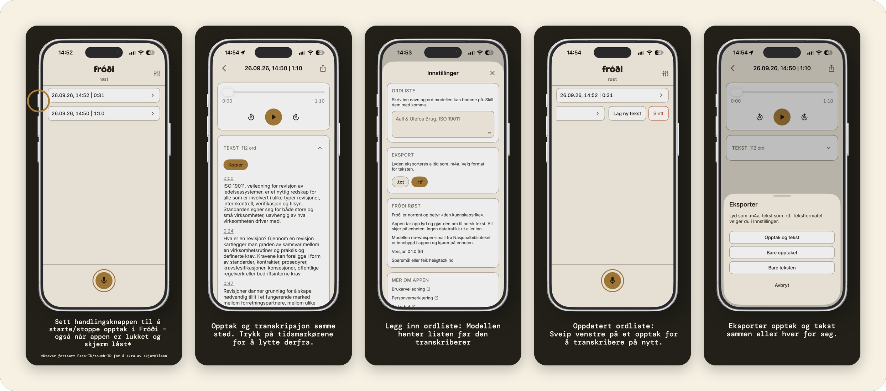

# Fróði røst

Tar opp lyd på iPhone og gjør den om til norsk tekst. Alt skjer på enheten.

«Fróði»: Norrønt for «den kunnskapsrike». «Røst»: Stemme, viser til opptaksfunksjonen.

## Status

Foreløpig i TestFlight, ikke App Store ennå. Bare tilgjengelig i Norge.

## Hva appen gjør

- Tar opp lyd, også når skjermen er låst, og så lenge du vil
- Fortsetter etter en telefonsamtale, og tar vare på opptaket hvis appen avsluttes midt i
- Starter og stopper med handlingsknappen, også når enheten er låst, og viser opptaket på låseskjermen
- Lager tekst av opptak på inntil ti minutter når du stopper, og av lengre opptak når du ber om det
- Skriver bokmål med tegnsetting og stor forbokstav, også av dialekt
- Deler teksten i avsnitt med tidspunkt du kan trykke på for å høre stedet i opptaket
- Eksporterer lyd som `.m4a` og tekst som `.txt` eller `.rtf`, hver for seg eller sammen

## Skjermbilder

Klikk på bildet for å se i full størrelse.

<a href="docs/screenshots.png"></a>

## Modell

**nb-whisper-small** fra Nasjonalbiblioteket: Tale til tekst. Bygger på OpenAIs Whisper, videretrent på 66 000 timer norsk tale fra Språkbanken og Nasjonalbibliotekets egen samling. Setter tegn og stor forbokstav selv, og skriver dialekt om til bokmål.

Modellen følger med appen og kjører på enheten. Gratis i bruk, ingen kobling til eksterne tjenester.

| Kilde                         | Lenke                                                                                   |
| ----------------------------- | --------------------------------------------------------------------------------------- |
| Modellen                      | [NbAiLab/nb-whisper-small](https://huggingface.co/NbAiLab/nb-whisper-small)             |
| CoreML-versjonen appen bruker | [Barrymanalow/nb-whisper-coreml](https://huggingface.co/Barrymanalow/nb-whisper-coreml) |
| Alle modellene fra NB         | [huggingface.co/NbAiLab](https://huggingface.co/NbAiLab)                                |
| Om AI-laben                   | [ai.nb.no](https://ai.nb.no/)                                                           |

## Krav

For bruk:

- iPhone med iOS 27.0 eller nyere
- Handlingsknappen krever iPhone 15 Pro eller nyere

For bygging:

- Xcode 27.0 med iOS 27.0 SDK
- xcodegen: `brew install xcodegen`
- 467 MB ledig plass til modellen

## Bygg

```bash
brew install xcodegen
./Scripts/fetch-model.sh   # kjør én gang
xcodegen generate
open Frodi.xcodeproj
```

Fra terminalen, mot appens egen simulator (se Test):

```bash
xcodebuild -project Frodi.xcodeproj -scheme Frodi \
  -destination 'platform=iOS Simulator,name=Frodi-Test' build
```

Mot en enhet: Appen har to bundle-ID-er, `com.Tazk.Frodi` og
`com.Tazk.Frodi.Widgets` for widget-utvidelsen. Xcode klargjør begge selv med
automatisk signering. Fra terminalen trenger `xcodebuild` flagget
`-allowProvisioningUpdates` første gang.

> **Viktig:** nb-whisper-small ligger ikke i git-repoet. Modellen er appens eneste talemotor, så bygget stopper med en feilmelding hvis den mangler.

`fetch-model.sh` sjekker hver fil mot `Scripts/model-checksums.txt` og stopper ved avvik. Hvordan modell og pakker er låst: [SECURITY.md](SECURITY.md).

## Test

Appen har sin egen simulator, `Frodi-Test`. Start den først, og vent til den er klar.

> **Viktig:** Hvis flere sesjoner deler simulatoren, feiler UI-testene med `Application failed preflight checks`. Det samme skjer hvis xcodebuild starter simulatoren selv og åpner appen før iOS er klar.

```bash
xcrun simctl create "Frodi-Test" \
  com.apple.CoreSimulator.SimDeviceType.iPhone-17-Pro \
  com.apple.CoreSimulator.SimRuntime.iOS-27-0
xcrun simctl boot Frodi-Test
xcrun simctl bootstatus Frodi-Test -b
xcodebuild -project Frodi.xcodeproj -scheme Frodi \
  -destination 'platform=iOS Simulator,name=Frodi-Test' \
  -collect-test-diagnostics never test
```

`-collect-test-diagnostics never` er ikke valgfritt i praksis: Uten det venter xcodebuild ti minutter på en diagnoserapport fra simulatoren som aldri kommer, etter at testene er ferdige. Med det tar hele kjøringen under ett minutt.

Talemotoren kan måles mot en lydfil, med og uten ordliste. Filen bør vare over tre minutter. Se toppen av `FrodiTests/PiecewiseTranscriptionTests.swift`.

## Arkitektur

Et opptak går gjennom disse stegene. Filene ligger under `Frodi/`, bortsett fra `FrodiWidgets/`.

| Steg                                                                                                                                                                           | Fil                                                                 |
| ------------------------------------------------------------------------------------------------------------------------------------------------------------------------------ | ------------------------------------------------------------------- |
| Handlingsknappen kjører intenten (App Intent) gjennom appens kontroll. Intenten starter og stopper opptak i bakgrunnen, også på låst enhet, og viser en Live Activity på låseskjermen så lenge opptaket går. Kontrollen og Live Activity-en tegnes av en widget-utvidelse | `Intents/ToggleRecordingIntent.swift`, `Services/RecordingActivity.swift`, `FrodiWidgets/` |
| Kontrolleren tar imot kall fra intenten og opptaksknappen, og «eier» databasen                                                                                                 | `Services/RecordingController.swift`                                |
| Opptakeren skriver lyden fortløpende til fil som PCM (Pulse-Code Modulation), i stedet for å holde den i minnet til opptaket stoppes. Opptaket går derfor ikke tapt ved krasj. Tar en samtale mikrofonen, lukkes filen, og opptaket fortsetter i en ny fil ved siden av når mikrofonen er tilbake | `Services/AudioRecorder.swift`                                      |
| Ved oppstart sammenligner kontrolleren databaselisten med filmappen. En fil uten tilhørende rad får en ny rad. En fil uten lyd fjernes                                          | `Services/RecordingController.swift`                                |
| Lagringen holder filen i appens sandkasse (App Sandbox) med filvern (Data Protection), utenom sikkerhetskopiering                                                              | `Services/AudioStorage.swift`                                       |
| Lagringen koder filene om til AAC, setter dem sammen til ett opptak og forsegler det med en nøkkel fra Secure Enclave (RecordingVault)                                                    | `Services/AudioStorage.swift`, `Services/RecordingVault.swift`      |
| Transcription lager teksten i puljer med nb-whisper, som kjører inne i appen. Fremdriften lagres etter hver pulje                                                            | `Services/Transcription.swift`, `Services/WhisperTranscriber.swift` |
| Transcript strukturerer teksten som avsnitt med tidspunkt                                                                                                                      | `Services/Transcript.swift`                                         |
| WordList sender ordlisten til modellen som prompt                                                                                                                              | `Services/WordList.swift`                                           |
| RecordingVault forsegler teksten på samme måte som lyden                                                                                                                                | `Services/RecordingVault.swift`                                     |
| RecordingDetailView viser teksten bak et vern (CaptureGuard) som skjuler den ved skjermopptak (Screen Recording) og appbytte (App Switcher)                                    | `Views/RecordingDetailView.swift`, `Views/CaptureGuard.swift`       |
| Ved eksport dekrypterer RecordingExport filene til en midlertidig mappe, og gir dem til delingsarket (Activity View, ofte kalt Share Sheet)                                    | `Services/RecordingExport.swift`, `Views/ShareSheet.swift`          |

Visningene når aldri talemotoren direkte. Alt går via protokollen `Transcriber`.

## Lisens

Kode: MIT, se [LICENSE](LICENSE). Modell, pakker, ikoner, fonter: Egne lisenser, se [TREDJEPART.md](TREDJEPART.md).

## Bidrag

Appen er et personlig prosjekt. Feil og forslag meldes som issues på GitHub. Pull request: Les [CONTRIBUTING.md](CONTRIBUTING.md) først.

## Mer

| Dokument                                   | Innhold                                                                |
| ------------------------------------------ | ---------------------------------------------------------------------- |
| [BRUKERVEILEDNING.md](BRUKERVEILEDNING.md) | Slik tar du opp, lager tekst, bruker ordlisten, eksporterer og sletter |
| [PERSONVERN.md](PERSONVERN.md)             | Hva som lagres, tillatelser, rettighetene dine, hvem som står bak      |
| [SECURITY.md](SECURITY.md)                 | Hva som beskyttes mot hva, og hvordan melde sårbarhet                  |
| [TILGJENGELIGHET.md](TILGJENGELIGHET.md)   | Kontrast, Dynamic Type, VoiceOver, og hva som er målt                  |
| [TREDJEPART.md](TREDJEPART.md)             | Modell, kode, ikoner og fonter, med versjoner og lisenser              |
| [CONTRIBUTING.md](CONTRIBUTING.md)         | Navn, språk, designsystem og reglene for endringer                     |
| [CHANGELOG.md](CHANGELOG.md)               | Hva som er endret, build for build                                     |

---

[Til toppen](#fróði-røst)
